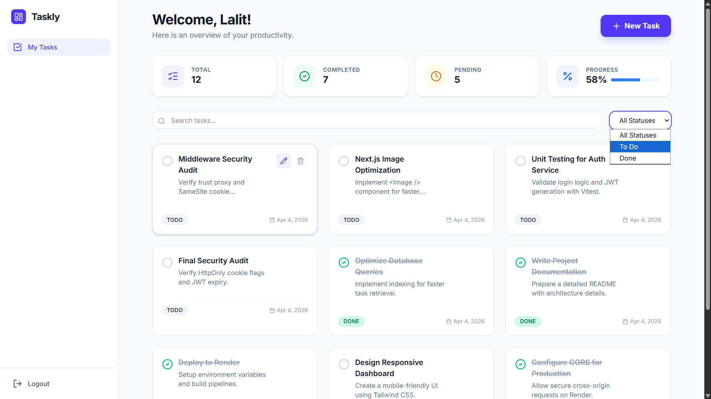
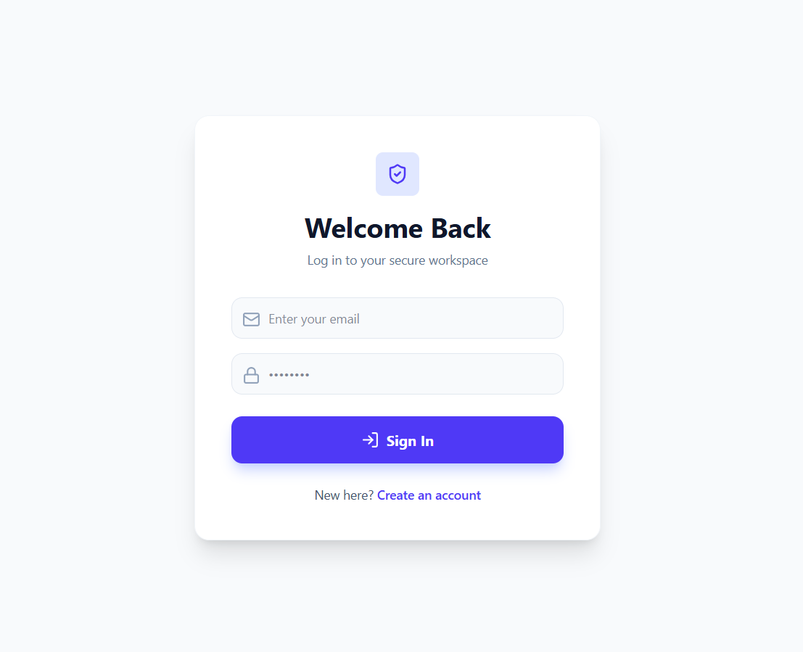
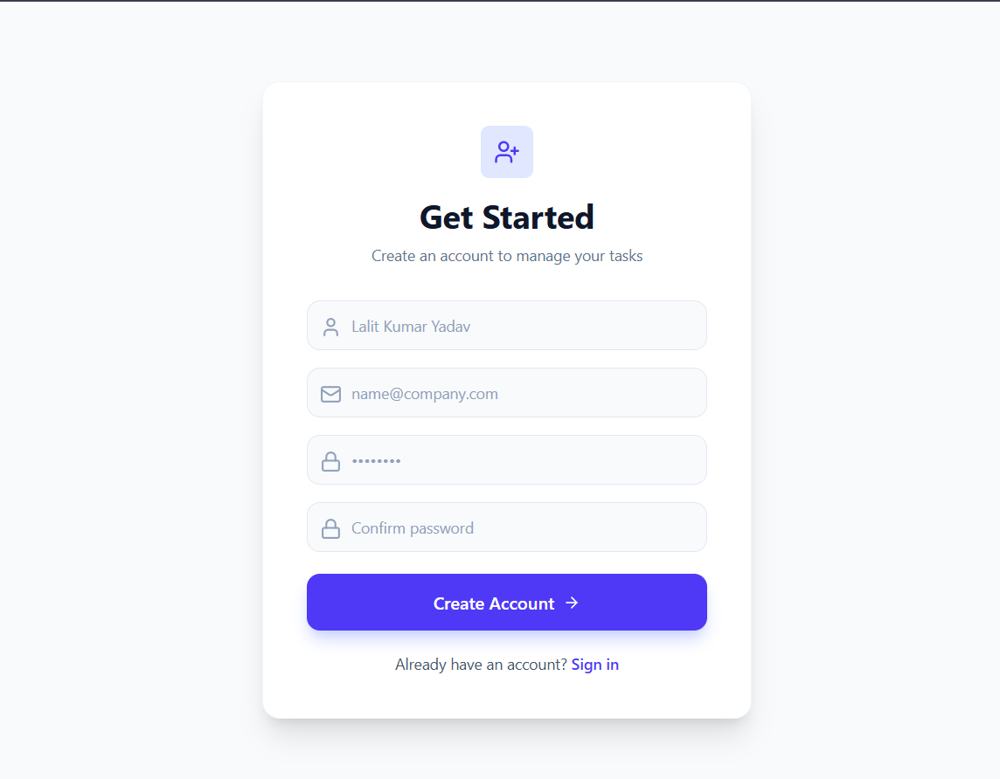
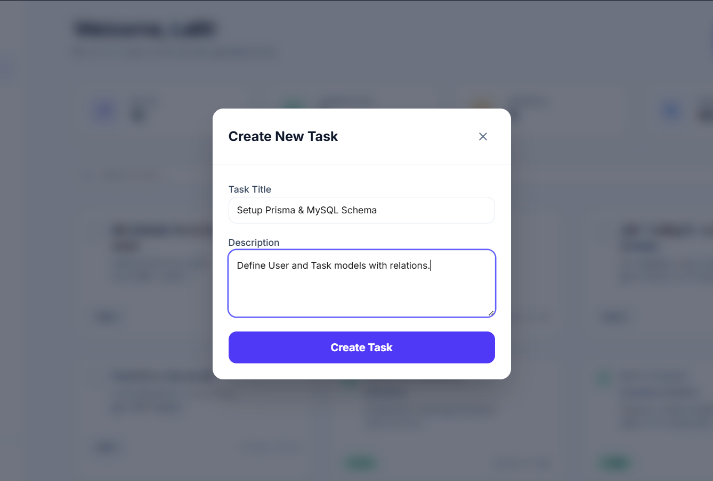
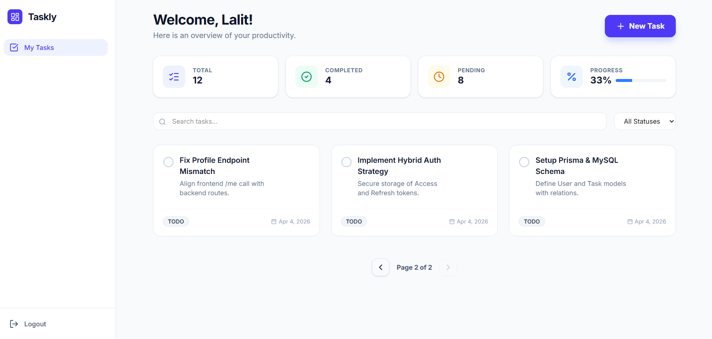

# 📝 Task Management System

A full-stack Task Management System built using **Next.js, Node.js, TypeScript, Prisma, and MySQL**, implementing secure JWT-based authentication and complete task management with pagination, filtering, and search.

---

## 🌐 Live Demo

- 🔗 Frontend: https://task-management-frontend-g9vb.onrender.com  
- 🔗 Backend API: https://task-manager-backend-b5zb.onrender.com  

---

## 📌 Features

### 🔐 Authentication
- User Registration & Login
- JWT-based authentication (Access + Refresh Tokens)
- Secure password hashing using bcrypt
- Persistent login across page refresh

---

### 🛠️ Task Management
- Create, Edit, Delete tasks
- Toggle task status (TODO / IN_PROGRESS / DONE)
- User-specific tasks (multi-user isolation)

---

### 🔎 Advanced Features
- Server-side Pagination
- Filtering by task status
- Search by task title
- Responsive UI (mobile + desktop)

---

### 🔔 User Experience
- Toast notifications for actions
- Clean and minimal UI
- Smooth interactions

---

## 🧱 Tech Stack

### Frontend
- Next.js (App Router)
- TypeScript
- Tailwind CSS
- Axios

### Backend
- Node.js
- Express.js
- TypeScript

### Database
- MySQL (Aiven)
- Prisma ORM

### Security
- JWT (Access + Refresh Tokens)
- bcrypt (password hashing)
- Cookie-based session handling

---

## 🔐 Authentication Strategy

This project uses a **hybrid authentication approach**:

- Access Token → stored in **localStorage** (for persistence across refresh)
- Refresh Token → stored in **HttpOnly cookie** (for security)

### Why this approach?

Since the frontend and backend are deployed on different domains (Render),  
third-party cookie restrictions may prevent cookies from being sent consistently.

To ensure a stable user experience:
- localStorage is used to maintain login state across refresh
- refresh tokens are used when available to renew sessions

> In production systems, this would be improved using a shared domain setup or in-memory token storage.

---

## 🏗️ Project Structure

### Backend

- Controllers → Handle request/response
- Services → Business logic
- Middleware → Authentication (JWT)
- Validators → Input validation
- Prisma → Database layer

---

### Frontend

- Pages → UI routes (Next.js App Router)
- Services → API calls
- Utils → Auth helpers
- Components → Reusable UI (TaskCard, etc.)

---

## 📸 Project Gallery

### 🚀 Dashboard


---

### 🔐 Authentication

| Login | Register |
|------|---------|
|  |  |

---

### 🛠️ Features

#### ➕ Create Task


#### 📄 Pagination


---

## ⚙️ Local Setup

### 1. Clone Repo

```bash
git clone https://github.com/YOUR_USERNAME/task-management-system.git
cd task-management-system

2. Install Dependencies
cd backend
npm install

cd ../frontend
npm install
3. Environment Variables

Create .env in backend:

DATABASE_URL=your_mysql_connection_string
JWT_ACCESS_SECRET=your_access_secret
JWT_REFRESH_SECRET=your_refresh_secret
FRONTEND_URL=http://localhost:3000
4. Run Project
# Backend
npm run dev

# Frontend
npm run dev
📊 API Endpoints
Auth
POST /auth/register
POST /auth/login
POST /auth/refresh
POST /auth/logout
Tasks
GET /tasks (pagination + filter + search)
POST /tasks
PATCH /tasks/:id
DELETE /tasks/:id
PATCH /tasks/:id/toggle
🧠 Key Highlights
Clean separation of concerns (Controller → Service → DB)
Scalable backend architecture
Secure authentication design
Efficient data handling (pagination + filtering)
👨‍💻 Author

Lalit Kumar Yadav
Developed for Software Engineering Assessment (Track A)

💡 Note to Reviewers

This project focuses on:

Clean architecture
Secure authentication
Real-world deployment considerations